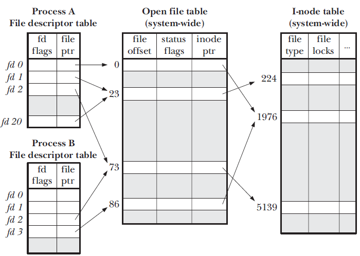

# Linux文件描述符

## 概述

在Linux系統中一切都可以看成是文件，文件可以分为：普通文件、目录文件、链接文件和设备文件等。

在Linux通用`I/O`模型中，`I/O`操作系列函数(系统调用)都是围绕一个叫做`文件描述符（fild descriptor，fd）`的整数展开。文件描述符是内核为了高效管理**已被打开**的文件所创建的索引，其是一个非负整数（通常是小整数），用于指代被打开的文件，所有执行`I/O`操作的系统调用都通过文件描述符。

> 文件描述符不仅仅用于普通文件的访问，也用于访问设备文件、管道、目录以及快速用户空间锁、FIFOs和套接字。遵循一切皆文件的理念，任何你能读写的东西都可以用文件描述符来访问。

每个进程按照惯例都会至少有三个打开的文件描述符：0、1和2，除非进程显示地关闭它们，0是`标准输入（stdin）`，1是`标准输出（stdout）`，2是`标准错误(stderr)`。C标准库提了预处理器宏：`STDIN_FILENO`，`STDOUT_FILENO`和`STDERR_FILENO`宏，以取代对以上整数的直接引用。正常情况下，程序在开始运行之前，由shell准备好这3个文件描述符。更准确的说法是，程序继承了shell文件描述符的副本，一般是指向shell所在的终端。当然了，可以通过在shell中对输入/输出进行重定向或者在程序启动后关闭并重新打开文件描述符，修改文件描述符指向。

`POSIX`标准要求每次打开文件时（含socket）必须使用当前进程中最小可用的文件描述符号码，因此，在网络通信过程中稍不注意就有可能造成串话。标准文件描述符图如下：

## 文件描述符fd的限制

linux系统中通常会对每个进程所能打开的文件数据有一个限制，当进程中已打开的文件描述符超过这个限制时，`open()`等获取文件描述符的系统调用都会返回失败。

linux下最大文件描述符的限制有两个方面，一个是用户级的限制，另外一个则是系统级限制。

- 用户级限制：`ulimit`命令看到的是用户级的最大文件描述符限制，也就是说每一个用户登录后执行的程序占用文件描述符的总数不能超过这个限制

- 系统级限制：`sysctl`命令和`proc`文件系统中查看到的数值是一样的，这属于系统级限制，它是限制所有用户打开文件描述符的总和

### 查看限制数量

查看用户级限制的数量，默认值为1024，命令：`ulimit -n`。

查看系统级限制的数量，命令：`sysctl -a | grep fs.file-max`或者`cat /proc/sys/fs/file-max`。

###　修改限制数量

修改用户级限制

- 临时修改，只对当前shell有效：`ulimit -SHn 2048`。
- 永久修改，编辑`/etc/security/limits.conf`文件，修改其中的`hard nofile`和`soft nofile`配置的数量。

修改系统级限制

- 通过`sysctl`命令修改`etc/sysctl.conf`文件：`sysctl -w fs.file-max=20480000`，完成后执行`sysctl -p`即可。

## 文件描述符和打开文件直接的关系

每一个`fd`与一个已打开的文件相对应，同时，不同的`fd`也会指向同一个文件。相同的文件可以被不同的进程打开也可以在同一个进程中被多次打开。

在linux系统中，内核维护了三个数据结构：

- 进程级`文件描述符表（file descriptor table）`
- 系统级`打开文件表（open file table）`
- 文件系统`i-node表（i-node table）`

三个数据结构之间的关系如下图所示：

### 文件描述符表

内核为每个进程维护一个`文件描述符表`，该表每一条目都记录了单个文件描述符的相关信息，包括：

- 控制文件描述符操作的一组标志。（目前，此类标志仅定义了一个，即`close-on-exec`标志）
- 对打开文件句柄的引用（对打开文件描述体的指针）

### 打开文件表

内核对所有打开的文件维护一个系统级别的打开文件描述表(`open file description table`)，简称打开文件表。表中条目称为打开文件句柄（`open file handle`）或打开文件描述体(`open file description`)，存储了与一个打开文件相关的全部信息，包括：

- 当前文件偏移量（file offset），调用`read()`和`write()`时更新，或使用`lseek()`直接修改
- 打开文件时所使用的状态标识（即，open()的flags参数）
- 文件访问模式（如调用open()时所设置的只读模式、只写模式或读写模式）
- 与信号驱动相关的设置
- 对该文件`i-node`对象的引用
- 文件类型（例如：常规文件、套接字或FIFO）和访问权限
- 一个指针，指向该文件所持有的锁列表
- 文件的各种属性，包括文件大小以及与不同类型操作相关的时间戳

### i-node表

每个文件系统会为存储于其上的所有文件(包括目录，无论打开否)维护一个`i-node`表，单个`i-node`包含以下信息：

- 文件类型(file type)，可以是常规文件、目录、套接字或FIFO
- 访问权限
- 文件锁列表(file locks)
- 文件大小

`i-node`存储在磁盘设备上，内核在内存中维护了一个副本，这里的`i-node`表为后者。副本除了原有信息，还包括：引用计数(从打开文件描述体)、所在设备号以及一些临时属性，例如文件锁。

#### 关闭文件的副作用

关闭文件有一些副作用，当最后一个引用某文件的文件描述符关闭后，在内核中表示该文件的数据结构就被释放了，当它释放时，与文件关联的inode的内存拷贝被清除，如果没有什么连接到该inode，它可能会从内存中清除（也有可能保留在内存中，因为内核为了效率缓存一些inode，但也可能不需要）。如果文件已经从磁盘解除链接，但在解除前仍保持打开，它在被关闭且inode从内存中移除前就不会真的被删除。因而，对close的调用可能会使某个已经解除链接的文件最终从磁盘上被删除。

### 场景解析

上图中，详细描述了两个进程诸多文件描述符，以及相互关系。

#### 文件描述符复制

在进程A中，文件描述符1和文件描述符20都指向同一个打开文件描述体(标号23)。这很可能是通过调用dup()系列函数形成的。

文件描述符复制，在某些场景下非常有用，比如：标准输入/输出重定向。在shell下，完成这个操作非常简单，大部分人都会，但是极少人思考过背后的原理。

大概描述一下需要的几个步骤，以标准输出(文件描述符为1)重定向为例：

- 打开目标文件，返回文件描述符n；
- 关闭文件描述符1；
- 调用dup将文件描述符n复制到1；
- 关闭文件描述符n；

#### 子进程继承文件描述符

进程A的文件描述符2和进程B的文件描述符2都指向同一个打开文件描述体(标号73)。这种情形很可能发生在调用fork()派生子进程之后，比如A调用fork()派生出B。这时，B作为子进程，从父进程A继承了文件描述符表，其中包括图中标明的文件描述符2。这就是子进程继承父进程打开的文件这句话的由来。

当然了，进程A通过Unix套接字将一个文件描述符传递给B也会出现类似的情形，但一般文件描述符数值是不一样的。同时为2要非常凑巧才发生。

## 总结

- 由于进程级文件描述符表的存在，不同的进程中会出现相同的文件描述符，它们可能指向同一个文件，也可能指向不同的文件
- 两个不同的文件描述符，若指向同一个打开文件句柄，将共享同一文件偏移量。因此，如果通过其中一个文件描述符来修改文件偏移量（由调用read()、write()或lseek()所致），那么从另一个描述符中也会观察到变化，无论这两个文件描述符是否属于不同进程，还是同一个进程，情况都是如此。
- 要获取和修改打开的文件标志（例如：O_APPEND、O_NONBLOCK和O_ASYNC），可执行fcntl()的F_GETFL和F_SETFL操作，其对作用域的约束与上一条颇为类似。
- 文件描述符标志（即，close-on-exec）为进程和文件描述符所私有。对这一标志的修改将不会影响同一进程或不同进程中的其他文件描述符

## 参考

- [Linux文件描述符](https://www.jianshu.com/p/430340c4a37a)
- [Linux中的文件描述符与打开文件之间的关系](https://blog.csdn.net/cywosp/article/details/38965239)
- [linux file description](http://guoshaoguang.com/blog/2013/08/03/linux-file-description/)
- [linux文件描述符限制及使用详解](https://www.jianshu.com/p/20f1e96557e3)